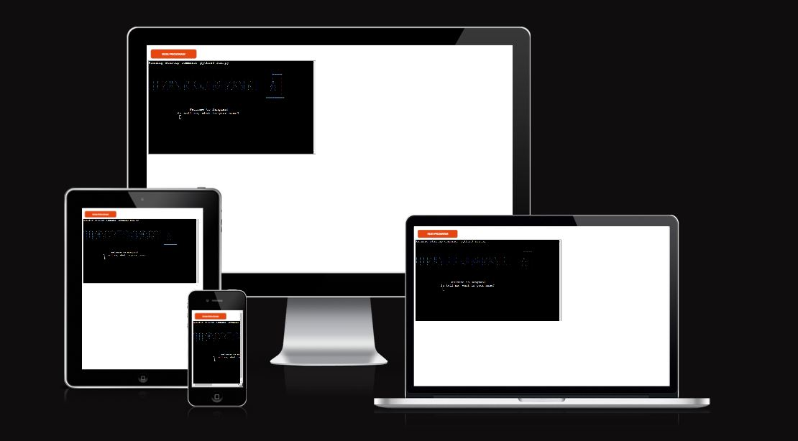
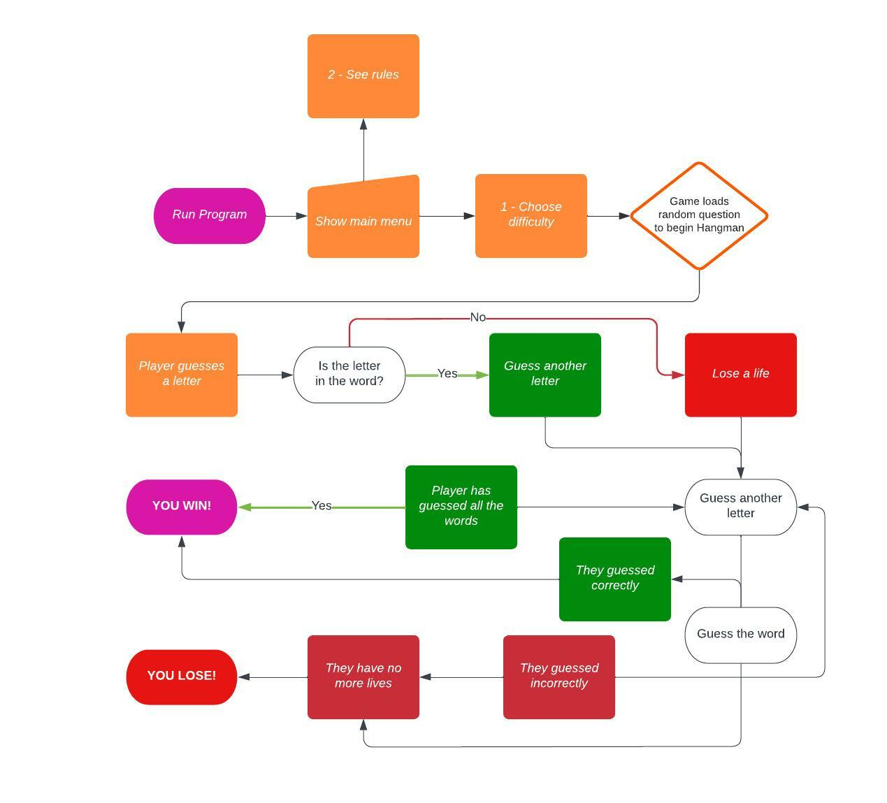
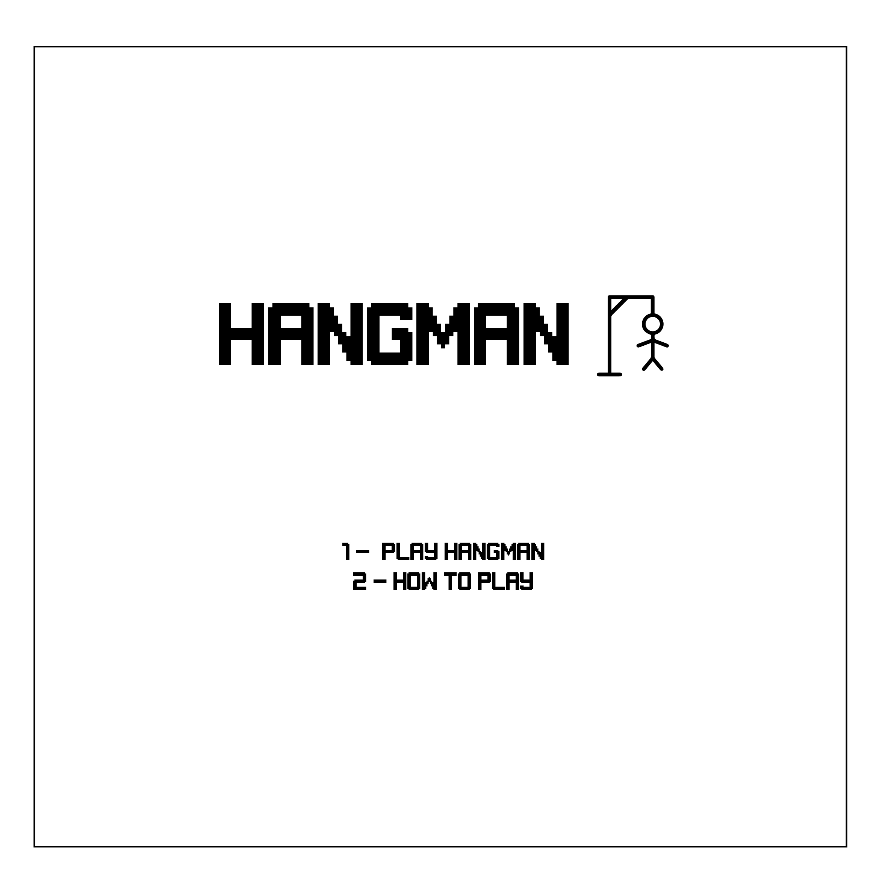
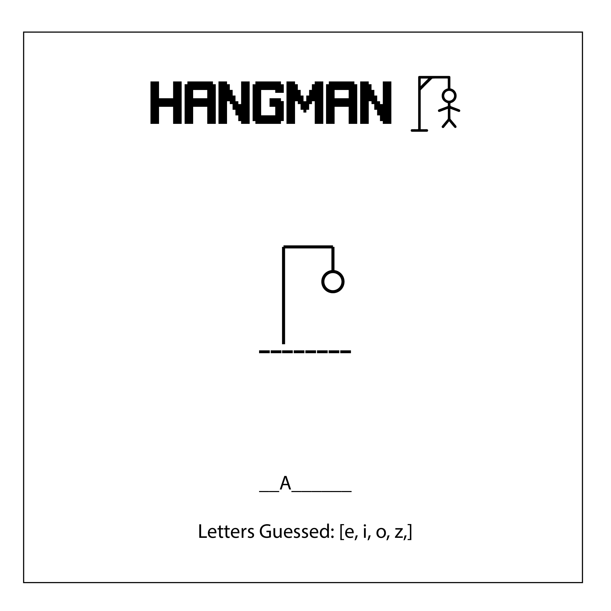
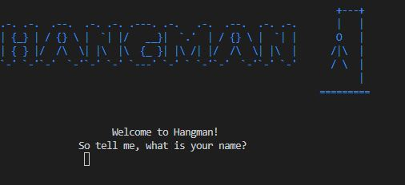
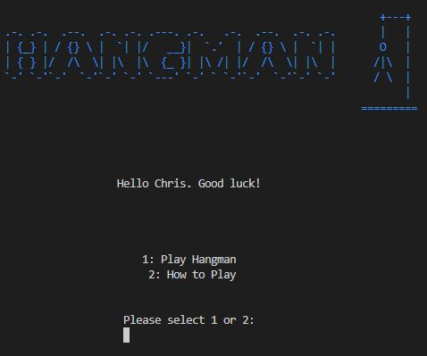
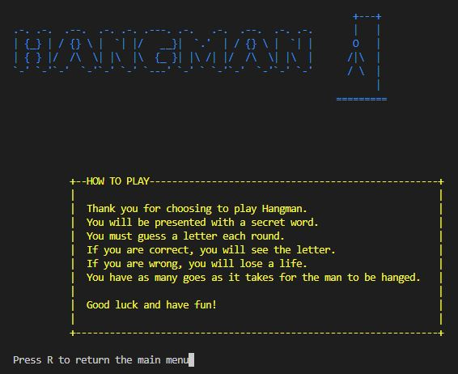
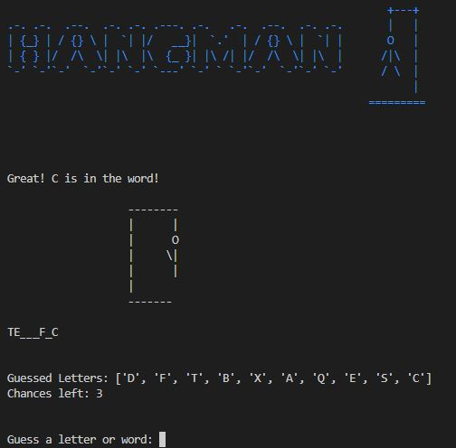

# Hangman Python Game
  

This is my Hangman game that I created in Python. This is a simple game that is played entirely in the command line

The user is presented with a secret word and have a couple of guesses to try to guess the word.
If you guess all the letters, you win! If not, you lose!

This is a simple but very fun game that everyone can enjoy!

The link for game can be found [here](https://hangman-game-ck-fsd.herokuapp.com/)!

---

# Flow Chart / Wireframes
  
  
  

These were the sketches that I began with to formulate my idea. The flowchart in particular was vital
at the beginning in helping me to visualise the finished game.

---

# How to Play

You will be presented with a secret word and must guess a letter each round.
If you are correct, you will see the letter. If you are wrong, you will lose a life.
You have as many goes as it takes for the man to be hanged.

---

# Features

When you run the program, you will be prompted to enter your name.
This is stored to be returned in the game

After that, you will be presented with a main menu with 2 options.
Play the game, or how to play.

This page tells the user how to play the hangman game, as believe it or not, some people may not know!

This is the main part of the game where the user guesses a letter or word. Each correct guess shows the letter.
Each incorrect guess loses the player a life and builds the hangman sketch.
A list is shown of the letters guessed so the user can keep track.

---

# Future Features

* To implement a difficult option so the loser can pick between easy, medium or hard

---

# Testing

I have manually tested this project by doing the following:

* Passing the code through the PEP8 checker with no errors
* Tested in my local terminal and also the Code Institute Heroku terminal

---

# Deployment

This project was deplyed using Code Institute's mock terminal for Heroku.
The steps for deployment are as follows:

* Fold or clone this respository
* Create a new Heroky app
* Set the buildbacks to Python and NodeJS in that order
* Link the Heroku app to the repository
* Click on Deploy

---

# Credits

   * I used the following tutorial to help with my creation of the python game: https://www.youtube.com/watch?v=m4nEnsavl6w&t=289s
   * Ascii Art Generator for the creation of all the text graphics.

**Acknowledgements**
* I would like to thank <a href="https://github.com/10xOXR">Chris Quinn</a> for helping me throughout this project. His guide and insight helped me greatly along the way and it is very much appreciated.

